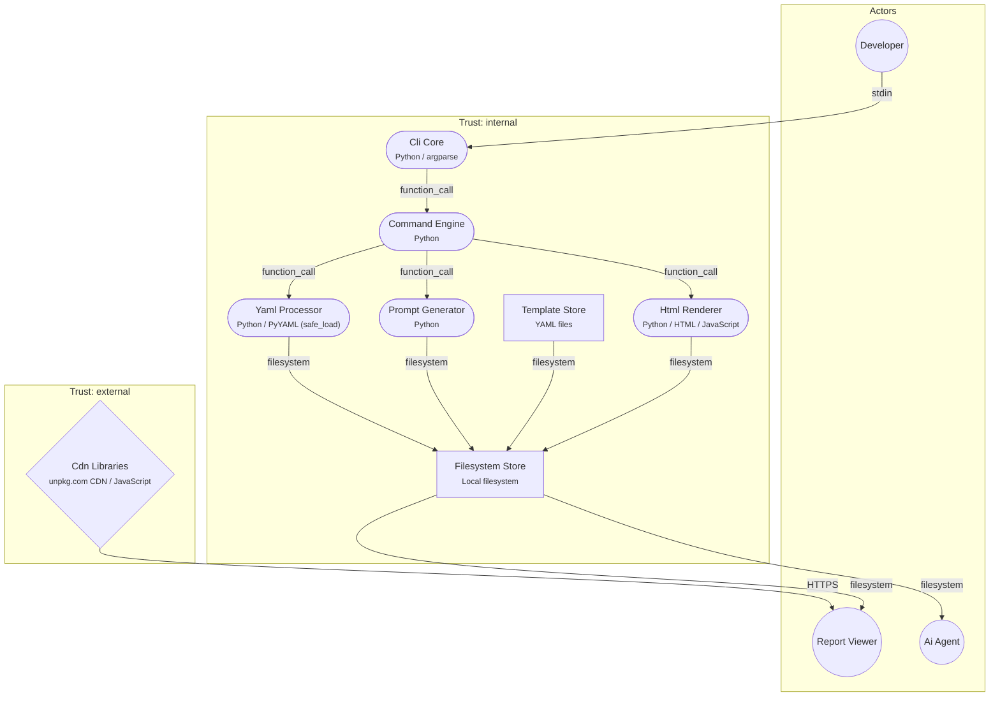

# TMDD CLI

**Threat Model Report** · Threat Modeling Driven Development - a Python CLI tool that manages YAML-based threat models, validates cross-references, generates AI prompts, and produces interactive HTML reports and diagrams

| Components | Data Flows | Features | Threats | Mitigations | Active Threats | Reviewed |
|:---:|:---:|:---:|:---:|:---:|:---:|:---:|
| 8 | 12 | 6 | 8 | 9 | 8 | 6/6 |

---

## System Diagram

## Features

### Project Initialization

> Create a new TMDD threat model project from a template (minimal, web-app, or api)

Updated: 2026-02-22 · ✅ Reviewed by mik0w (2026-02-22)

**Data Flows:** `df_developer_to_cli`, `df_cli_to_commands`, `df_init_templates`  
**Threat Actors:** `ci_pipeline_untrusted`

| | Threat | STRIDE | Mitigations |
|:---:|:---|:---:|:---|
| 🟢 | `yaml_template_injection` YAML template injection via init command name/description | **T** | `yaml_escape_init_input` *(default)* |

### Threat Model Validation

> Validate all .tmdd/ YAML files for structural correctness and cross-reference integrity

Updated: 2026-02-22 · ✅ Reviewed by mik0w (2026-02-22)

**Data Flows:** `df_developer_to_cli`, `df_cli_to_commands`, `df_commands_to_yaml`, `df_yaml_to_filesystem`  
**Threat Actors:** `malicious_insider_fs`

| | Threat | STRIDE | Mitigations |
|:---:|:---|:---:|:---|
| 🟡 | `no_audit_trail` No audit trail for threat model modifications | **R** | **Risk accepted** |

### Feature Workflow

> Generate AI prompts for threat modeling new features or producing secure implementation guidance

Updated: 2026-02-22 · ✅ Reviewed by mik0w (2026-02-22)

**Data Flows:** `df_developer_to_cli`, `df_cli_to_commands`, `df_commands_to_yaml`, `df_yaml_to_filesystem`, `df_commands_to_prompts`, `df_prompts_to_filesystem`, `df_filesystem_to_agent`  
**Threat Actors:** `malicious_insider_fs`

| | Threat | STRIDE | Mitigations |
|:---:|:---|:---:|:---|
| 🟡 | `prompt_injection` Prompt injection via threat model content in generated AI prompts | **T** | `prompt_delimiters` *(default)* |

### Compilation

> Generate consolidated YAML and AI implementation prompts from the full threat model

Updated: 2026-02-22 · ✅ Reviewed by mik0w (2026-02-22)

**Data Flows:** `df_developer_to_cli`, `df_cli_to_commands`, `df_commands_to_yaml`, `df_yaml_to_filesystem`, `df_commands_to_prompts`, `df_prompts_to_filesystem`  
**Threat Actors:** `malicious_insider_fs`

| | Threat | STRIDE | Mitigations |
|:---:|:---|:---:|:---|
| 🟡 | `prompt_injection` Prompt injection via threat model content in generated AI prompts | **T** | `prompt_delimiters` *(default)* |

### Report Generation

> Generate a standalone interactive HTML threat model report with architecture diagram

Updated: 2026-02-22 · ⚠️ Reviewed by mik0w (2026-01-01) — **needs re-review**

**Data Flows:** `df_developer_to_cli`, `df_commands_to_yaml`, `df_yaml_to_filesystem`, `df_commands_to_html`, `df_html_to_filesystem`, `df_cdn_to_browser`, `df_filesystem_to_viewer`  
**Threat Actors:** `cdn_package_attacker`, `malicious_insider_fs`, `ci_pipeline_untrusted`

| | Threat | STRIDE | Mitigations |
|:---:|:---|:---:|:---|
| 🟠 | `cdn_supply_chain_attack` Supply chain attack via CDN JavaScript dependencies | **T** | `sri_hashes_cdn`, `bundle_libs_locally` *(default)* |
| 🟡 | `xss_stored_diagram` Stored XSS via innerHTML in diagram JavaScript | **T** | `replace_innerhtml_textcontent`, `js_html_escape_helper` *(default)* |
| 🟡 | `xss_stored_node_info` Stored XSS via innerHTML in node-info panel | **T** | `replace_innerhtml_textcontent`, `js_html_escape_helper` *(default)* |
| 🟢 | `json_script_breakout` Script tag breakout in embedded JSON diagram data | **T** | `js_html_escape_helper`, `enhanced_safe_json` *(default)* |
| 🟢 | `report_path_traversal` Report output path traversal via --name parameter | **T** | `validate_report_filename` *(default)* |

### Diagram Generation

> Generate a standalone interactive HTML architecture diagram with optional feature highlighting

Updated: 2026-02-22 · ✅ Reviewed by mik0w (2026-02-22)

**Data Flows:** `df_commands_to_yaml`, `df_yaml_to_filesystem`, `df_commands_to_html`, `df_html_to_filesystem`, `df_cdn_to_browser`, `df_filesystem_to_viewer`  
**Threat Actors:** `cdn_package_attacker`, `malicious_insider_fs`

| | Threat | STRIDE | Mitigations |
|:---:|:---|:---:|:---|
| 🟠 | `cdn_supply_chain_attack` Supply chain attack via CDN JavaScript dependencies | **T** | `sri_hashes_cdn`, `bundle_libs_locally` *(default)* |
| 🟡 | `xss_stored_diagram` Stored XSS via innerHTML in diagram JavaScript | **T** | `replace_innerhtml_textcontent`, `js_html_escape_helper` *(default)* |
| 🟡 | `xss_stored_node_info` Stored XSS via innerHTML in node-info panel | **T** | `replace_innerhtml_textcontent`, `js_html_escape_helper` *(default)* |
| 🟢 | `json_script_breakout` Script tag breakout in embedded JSON diagram data | **T** | `js_html_escape_helper`, `enhanced_safe_json` *(default)* |

---

## Components

| ID | Description | Type | Technology | Trust Boundary | Source Paths |
|:---|:---|:---:|:---|:---:|:---|
| `cli_core` | Argparse-based CLI entry point that parses user commands and dispatches to command handlers (src/cli.py, src/__main__.py) | **service** | `Python / argparse` | **internal** | `src/cli.py` `src/__main__.py` |
| `command_engine` | Command handlers for init, lint, feature, and compile operations (src/commands/) | **service** | `Python` | **internal** | `src/commands/**` |
| `yaml_processor` | YAML loading via yaml.safe_load(), threat model assembly, and cross-reference validation (src/utils.py, src/commands/lint.py) | **service** | `Python / PyYAML (safe_load)` | **internal** | `src/utils.py` |
| `prompt_generator` | Generates AI prompt text files for threat modeling and secure coding workflows (src/generators/threat_prompt.py, agent_prompt.py) | **service** | `Python` | **internal** | `src/generators/**` |
| `template_store` | Bundled YAML template files (minimal, web-app, api) used by init command for project scaffolding (src/templates/) | **other** | `YAML files` | **internal** | `src/templates/**` |
| `html_renderer` | Generates interactive HTML reports and architecture diagrams with embedded Cytoscape.js (report.py, diagram.py) | **service** | `Python / HTML / JavaScript` | **internal** | `report.py` `diagram.py` |
| `filesystem_store` | Local filesystem storage for .tmdd/ YAML files, generated prompts, reports, and diagrams (.tmdd/, .tmdd/out/) | **other** | `Local filesystem` | **internal** | — |
| `cdn_libraries` | External CDN (unpkg.com) serving Cytoscape.js 3.30.4, dagre 0.8.5, and cytoscape-dagre 2.5.0 loaded client-side in generated HTML | **external** | `unpkg.com CDN / JavaScript` | **external** | — |

## Data Flows

| ID | Path | Description | Protocol | Auth |
|:---|:---|:---|:---:|:---|
| `df_developer_to_cli` | `developer` → `cli_core` | CLI commands with arguments (path, feature name, description, template name) | **stdin** | none |
| `df_cli_to_commands` | `cli_core` → `command_engine` | Parsed argparse Namespace object with user-provided values | **function_call** | none |
| `df_commands_to_yaml` | `command_engine` → `yaml_processor` | File paths to load; returns parsed YAML dicts (system, actors, components, threats, mitigations) | **function_call** | none |
| `df_yaml_to_filesystem` | `yaml_processor` → `filesystem_store` | Read .tmdd/ YAML files (system.yaml, actors.yaml, components.yaml, features.yaml, data_flows.yaml, threats/*.yaml) | **filesystem** | none |
| `df_init_templates` | `template_store` → `filesystem_store` | Template YAML files with {{name}} and {{description}} placeholders substituted with user input, written to target directory | **filesystem** | none |
| `df_commands_to_prompts` | `command_engine` → `prompt_generator` | Loaded threat model dict and feature metadata for prompt generation | **function_call** | none |
| `df_prompts_to_filesystem` | `prompt_generator` → `filesystem_store` | Generated text prompt files (*.threatmodel.txt, *.prompt.txt) written to .tmdd/out/ | **filesystem** | none |
| `df_commands_to_html` | `command_engine` → `html_renderer` | Loaded threat model dict passed to report/diagram generators | **function_call** | none |
| `df_html_to_filesystem` | `html_renderer` → `filesystem_store` | Generated HTML files (tm.html, diagram.html) with embedded JSON data and JavaScript, written to .tmdd/out/ | **filesystem** | none |
| `df_cdn_to_browser` | `cdn_libraries` → `report_viewer` | JavaScript libraries (cytoscape.min.js, dagre.min.js, cytoscape-dagre.js) loaded via script tags from unpkg.com | **HTTPS** | none |
| `df_filesystem_to_viewer` | `filesystem_store` → `report_viewer` | HTML report/diagram files served to browser with embedded threat model data in JSON format | **filesystem** | none |
| `df_filesystem_to_agent` | `filesystem_store` → `ai_agent` | Generated prompt text files consumed by AI agent for threat modeling or secure code generation | **filesystem** | none |

## Threat Catalog

*Threats without ✅ in the Mapped column are defined but not currently assigned to any feature.*

| ID | Name | Severity | STRIDE | CWE | Suggested Mitigations | Mapped? |
|:---|:---|:---:|:---:|:---:|:---|:---:|
| `yaml_template_injection` | **YAML template injection via init command name/description** | 🟢 LOW | **T** Tampering | `CWE-74` | `yaml_escape_init_input` | ✅ |
| `cdn_supply_chain_attack` | **Supply chain attack via CDN JavaScript dependencies** | 🟠 HIGH | **T** Tampering | `CWE-829` | `sri_hashes_cdn, bundle_libs_locally` | ✅ |
| `xss_stored_diagram` | **Stored XSS via innerHTML in diagram JavaScript** | 🟡 MEDIUM | **T** Tampering | `CWE-79` | `replace_innerhtml_textcontent, js_html_escape_helper` | ✅ |
| `xss_stored_node_info` | **Stored XSS via innerHTML in node-info panel** | 🟡 MEDIUM | **T** Tampering | `CWE-79` | `replace_innerhtml_textcontent, js_html_escape_helper` | ✅ |
| `no_audit_trail` | **No audit trail for threat model modifications** | 🟡 MEDIUM | **R** Repudiation | `CWE-778` | `git_change_tracking` | ✅ |
| `prompt_injection` | **Prompt injection via threat model content in generated AI prompts** | 🟡 MEDIUM | **T** Tampering | `CWE-77` | `prompt_delimiters` | ✅ |
| `json_script_breakout` | **Script tag breakout in embedded JSON diagram data** | 🟢 LOW | **T** Tampering | `CWE-79` | `js_html_escape_helper, enhanced_safe_json` | ✅ |
| `report_path_traversal` | **Report output path traversal via --name parameter** | 🟢 LOW | **T** Tampering | `CWE-22` | `validate_report_filename` | ✅ |

## Mitigations Catalog

*Mitigations without ✅ in the Applied column are defined but not currently used by any feature.*

| ID | Description | Applied? |
|:---|:---|:---:|
| `yaml_escape_init_input` | Escape or quote user-provided name/description values before substituting into YAML templates during init, using yaml.dump() or proper YAML string quoting to prevent structural injection (`src/commands/init.py`:36-39) | ✅ |
| `sri_hashes_cdn` | Pin CDN library versions with Subresource Integrity (SRI) hashes on all <script> tags in generated HTML to prevent tampered JavaScript from executing (`report.py`:943-945, `diagram.py`:143-145) | ✅ |
| `bundle_libs_locally` | Bundle Cytoscape.js and dagre libraries locally instead of relying on CDN, eliminating the external dependency and enabling fully offline report viewing (`report.py`:943-945) | ✅ |
| `replace_innerhtml_textcontent` | Replace innerHTML assignments in _DIAGRAM_JS with textContent for plain text values, or use DOM createElement/createTextNode for safe HTML construction (`report.py`:572-872) | ✅ |
| `js_html_escape_helper` | Implement a JavaScript HTML-escape helper function in _DIAGRAM_JS and apply it to all threat model values (names, descriptions, labels) before inserting into HTML strings (`report.py`:572-872) | ✅ |
| `git_change_tracking` | Rely on Git version control for change tracking and attribution of .tmdd/ YAML files; document this requirement in README and generated AGENTS.md | — |
| `prompt_delimiters` | Add clear delimiter markers and role boundaries in generated AI prompts to reduce the effectiveness of prompt injection from threat model content (`src/generators/agent_prompt.py`:17-19, `src/generators/threat_prompt.py`) | ✅ |
| `enhanced_safe_json` | Enhance _safe_json() to escape additional dangerous characters beyond </ including HTML entities and ensure Content-Type is set correctly for embedded JSON data (`report.py`:113-114) | ✅ |
| `validate_report_filename` | Validate the --name output filename in report.py by stripping path separators and applying safe_name() or os.path.basename() before joining with the output directory, consistent with diagram.py's safe_name() approach (`report.py`:1085-1088) | ✅ |

## Actors

### System Actors

- **`developer`** — Developer or security engineer who runs TMDD CLI commands (init, lint, feature, compile) and edits .tmdd/ YAML files
- **`ai_agent`** — AI coding agent that consumes generated prompt files (.tmdd/out/*.prompt.txt, *.threatmodel.txt) to produce threat models or secure code
- **`report_viewer`** — Person viewing generated HTML reports and diagrams in a web browser, potentially including non-developers or stakeholders

### Threat Actors

- **`cdn_package_attacker`** — External attacker who compromises a CDN or npm package used by TMDD-generated HTML reports
- **`malicious_insider_fs`** — Malicious insider with filesystem access who tampers with .tmdd/ YAML files to inject harmful content into reports or AI prompts
- **`ci_pipeline_untrusted`** — Automated CI/CD pipeline that invokes TMDD commands with untrusted or user-controlled input parameters

---

*Generated by TMDD (Threat Modeling Driven Development) · TMDD CLI*
